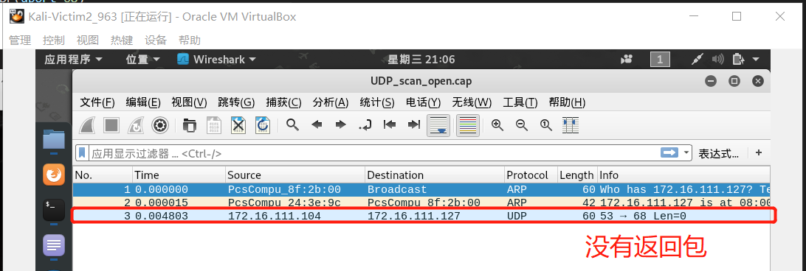

# 网络扫描

## 实验内容

- [x] TCP connect scan / TCP stealth scan
- [x] TCP Xmas scan / TCP fin scan / TCP null scan
- [x] UDP scan
- [x] 提供每次抓包结果并分析扫描方法原理


## 实验环境


## 实验步骤

```bash
# 查看本机开放端口
netstat -luntp

# 打开关闭apache2即开启关闭本机80端口
systemctl start apache2     #操作系统版本够新，更推荐使用
service apache2 start/stop

# 启动/关闭防火墙
ufw enable/disable

# 开放/禁止外部访问
ufw allow/deny 端口号
```


### TCP connect scan

```python
from scapy.all import *

pkt1 = IP(src="172.16.111.104",dst="172.16.111.127")/TCP(sport=RandShort(),dport=80,flags="S")
ret  = sr1(pkt1,timeout=10)
# 可以直接使用 `if（ret is None）`
if(str(type(ret))=="<class 'NoneType'>"):            #端口过滤
   print("Filtered")
elif(ret.haslayer(TCP)):                             #如果回复了tcp数据
   if(ret.getlayer(TCP).flags == 0x12):              #端口打开 SYN-ACK        
      pkt2 = IP(dst="172.16.111.127")/TCP(sport=RandShort(),dport=80,flags="AR")
      send_rst = sr1(pkt2,timeout=10)                #RST +ACK           
      print("open")
   elif (ret.getlayer(TCP).flags == 0x14):           #端口关闭 RST
      print("closed")

```

**端口为开放状态时**


**端口为关闭状态时**


**端口为过滤状态时**


### TCP XMAS scan

```python
from scapy.all import *

pkt = IP(dst="172.16.111.127")/TCP(dport=RandShort(),flags="FPU")
ret = sr1(pkt,timeout=10)
# 可以直接使用 `if（ret is None）`
if (str(type(ret))=="<class 'NoneType'>"):
	print("open|Filtered")
elif(ret.haslayer(TCP)):
	if(ret.getlayer(TCP).flags == 0x14):  
		print("Closed")
elif(ret.haslayer(ICMP)):
	if(int(ret.getlayer(ICMP).type)==3 and int(ret.getlayer(ICMP).code) in [1,2,3,9,10,13]):
		print("Filtered")
```

**端口为开放状态时**


**端口为关闭状态时**


**端口为过滤状态时**


### UDP scan

```python
from scapy.all import *

pkt = IP(dst="172.16.111.127")/UDP(dport=68)
ret = sr1(pkt,timeout=10)
# 可以直接使用 `if（ret is None）`
if (str(type(ret))=="<class 'NoneType'>"): 
    print("open|flitered")
elif (ret.haslayer(UDP)): 
    print("open")
elif(ret.haslayer(ICMP)): 
    if(int(ret.getlayer(ICMP).type)==3 and int(ret.getlayer(ICMP).code)==3):
        print("closed")
    elif(int(ret.getlayer(ICMP).type)==3 and int(ret.getlayer(ICMP).code) in [1,2,9,10,13]):
        print("filtered")
else:
    print(str(type(ret)))
```

**端口为开放状态时**




**端口为关闭状态时**


**端口为过滤状态时**


### 实验结果

| 端口类型及端口号 | 端口状态 | 扫描类型         | 扫描者       | 被扫描者     | 扫描者的扫描结果 |
| ---------------- | -------- | ---------------- | ------------ | ------------ | ---------------- |
| tcp：80          | 开放     | TCP connect scan | Kali-Victim1 | Kali-Victim2 | open             |
| tcp：80          | 关闭     | TCP connect scan | Kali-Victim1 | Kali-Victim2 | closed           |
| tcp：80          | 过滤     | TCP connect scan | Kali-Victim1 | Kali-Victim2 | filtered         |
| tcp：80          | 开放     | TCP XMAS scan    | Kali-Victim1 | Kali-Victim2 | open\|filtered   |
| tcp：80          | 关闭     | TCP XMAS scan    | Kali-Victim1 | Kali-Victim2 | closed           |
| tcp：80          | 过滤     | TCP XMAS scan    | Kali-Victim1 | Kali-Victim2 | open\|filtered   |
| udp:68           | 开放     | UDP scan         | Kali-Victim1 | Kali-Victim2 | open\|filtered   |
| udp:70           | 关闭     | UDP scan         | Kali-Victim1 | Kali-Victim2 | closed           |
| udp:68           | 过滤     | UDP scan         | Kali-Victim1 | Kali-Victim2 | open\|filtered   |


## 实验遇到的问题

- inconsistent use of tabs and spaces in indentation

  缩进中制表符和空格的使用不一致

  解决：改为一致即可

  

## 实验总结

- TCP connect scan

  TCP connect 是客户机和服务器之间的三次握手。如果进行了三方握手，那么就建立了通信。

  试图连接到服务器80端口上的的客户机通过发送一个设置了SYN标志的TCP包和它要连接的端口来初始化连接。如果该端口在服务器上打开并接受连接，它将使用设置了SYN和ACK标志的TCP包进行响应。在最后一次握手时，客户端发送确认ACK和RST标志来建立连接。如果完成了三次握手，则服务器上的端口是打开的。

  所以v1向v2发送tcp连接请求，我们在抓到的包里可以看到，当端口开放时，v2发送v1 含[SYN,ACK]的包；当端口关闭时，v2发送v1 含[RST,ACK]的包；当端口过滤时，没有收到返回包。

- TCP XMAS scan

  在圣诞扫描中，设置了PSH、FIN和URG标志的TCP包以及要连接的端口被发送到服务器。如果端口是打开的，那么服务器将没有响应。如果服务器使用TCP包中设置的RST标志进行响应，则服务器上的端口将关闭。如果服务器使用ICMP包响应，并且ICMP具有不可到达的错误类型3和ICMP代码1、2、3、9、10或13，那么端口将被过滤，并且不能从响应中推断端口是打开的还是关闭的。

  通过此次实验可以看出，在没有返回包的情况下，有open和filtered两种可能，返回tcp包含[RST,ACK]，说明端口关闭。

- UDP scan

  TCP是面向连接的协议，UDP是无连接的协议。UDP 扫描时，客户端发送一个UDP数据包，该数据包带有要连接的端口号。如果服务器使用UDP包响应客户端，则该特定端口在服务器上是打开的。客户端发送一个UDP包和它想要连接的端口号，但是服务器用一个ICMP端口来响应，错误类型3和代码3是不可到达的，这意味着该端口在服务器上是关闭的。如果服务器使用ICMP错误类型3和代码1、2、9、10或13来响应客户机，那么服务器上的端口将被过滤。如果服务器对该端口的客户端UDP请求包没有发送响应，则可以断定服务器上的端口是打开的或过滤的，端口的最终状态无法确定。

  从结果来看，UDP扫描也无法确定端口的形态。


## 参考资料

[自己动手编程实现并讲解TCP connect scan/TCP stealth scan/TCP XMAS scan/UDP scan](https://blog.csdn.net/jackcily/article/details/83117884)

[scapy官方文档](https://scapy.readthedocs.io/en/latest/#starting-scapy)


