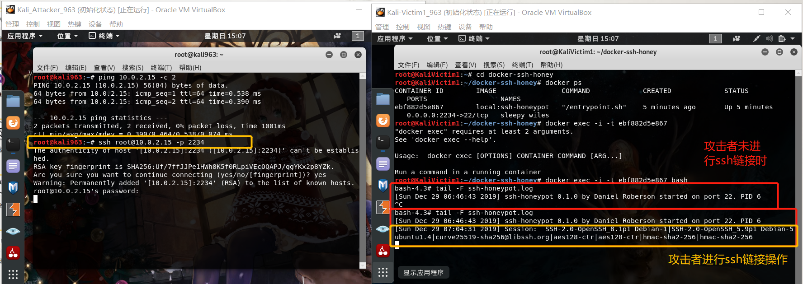
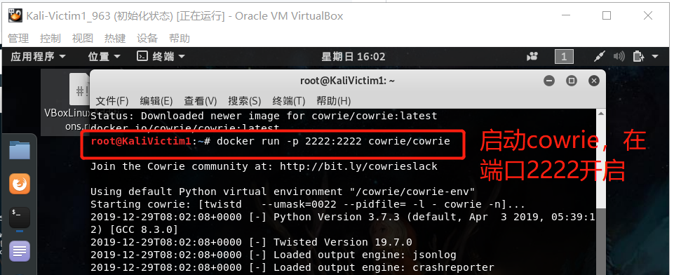
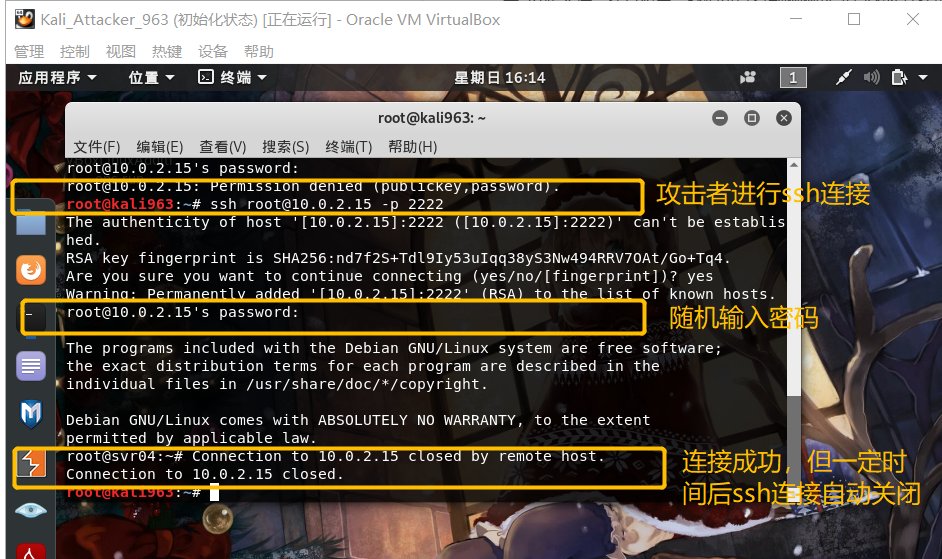

# 第十一章 常见蜜罐体验和探索

## 实验目的

- 了解蜜罐的分类和基本原理
- 了解不同类型蜜罐的适用场合
- 掌握常见蜜罐的搭建和使用

## 实验环境

- 从 paralax/awesome-honeypots中选择 1 种低交互蜜罐和 1 种中等交互蜜罐进行搭建实验
  - 推荐 `SSH` 蜜罐

- kali 虚拟机
  - Kali_Attacker_963 NAT网络 10.0.2.4
  - Kali_Victim1_963   NAT网络 10.0.2.15

## 实验要求

- [x] 记录蜜罐的详细搭建过程；
- [x] 使用 `nmap` 扫描搭建好的蜜罐并分析扫描结果，同时分析「 `nmap` 扫描期间」蜜罐上记录得到的信息；
- [x] 如何辨别当前目标是一个「蜜罐」？以自己搭建的蜜罐为例进行说明；
- [x] （可选）总结常见的蜜罐识别和检测方法；

## 实验步骤

- 网络连通情况

  

### 蜜罐的搭建过程

在受害者主机，即Kali_Victim1_963 中搭建蜜罐

#### ssh-Honeypot

- 低交互型蜜罐

- 在victim中安装docker容器，便于实验观察

- 安装docker

  ```bash
  apt-get update
  # 删除原系统的docker
  apt-get purge docker.io
  # 添加docker-ce的apt源
  apt-get install -y apt-transport-https ca-certificates curl software-properties-common
  # 添加docker所需密钥
  curl -fsSL https://download.daocloud.io/docker/linux/ubuntu/gpg | sudo apt-key add -
  # 验证密钥的可用性
  sudo apt-key fingerprint 0EBFCD88
  # 安装docker
  sudo apt-get update 
  sudo apt-get install docker
  # 开启docker服务并测试是否安装成功
  systemctl start docker
  sudo docker run anything
  # 查看镜像
  docker images
  ```

  

  

  

  

  

  

- 安装ssh-honeypot

  ```bash
  # 安装libssh&libjson-c
  apt install libssh-dev libjson-c-dev
  
  # 安装ssh，暂不设置密码
  ssh-keygen -t rsa -f ./ssh-honeypot.rsa
  
  # 安装docker-ssh-honeypot
  git clone https://github.com/random-robbie/docker-ssh-honey
  # 构建镜像
  docker build . -t local:ssh-honeypot
  # 运行镜像 格式为本地端口:容器端口 
  docker run -p 2234:22 local:ssh-honeypot
  # 找到容器id，进入容器
  docker cp
  docker exec -i -t id bash
  # 查看日志
  tail -F ssh-honeypot.log
  ```

  

  

  

  

  

  

  

- 经过对日志文件的查看，我们可以查看都攻击者的所有行为，并记录下攻击者的ip地址和输入操作等，达到了蜜罐收集信息的目的。


#### Cowrie

- 中等交互型蜜罐

- 安装Cowrie

  ```bash
  # 在docker中安装Cowrie
  docker pull cowrie/cowrie
  # 启动cowrie，在端口2222开启
  docker run -p 2222:2222 cowrie/cowrie
  ```

  

  

- 攻击者进行ssh连接

  ```bash
  #查看日志
  cat cowrie.json 
  ```

  连接成功，但是一定时间后ssh连接自动关闭了

  

  

  


### nmap扫描分析

- ssh-Honeypot

  攻击者对目标端口进行nmap扫描，但是日志文件中没有相关记录，因为ssh-Honeypot是一种低交互型蜜罐，只能记录简单的ssh连接

  

- cowrie

  攻击者nmap扫描没有日志记录，说明这个蜜罐也不能检测防范nmap扫描

  


### 识别蜜罐

- 在ssh连接下进行联通性测试

  结果可以在错误输入curl的时候发现是python报错，从而发现蜜罐

  

- 进行nmap扫描`nmap -sX -p 2222 -n -vv 10.0.2.15`，service是 EthernetIp-1，也暴露了蜜罐的存在

  


## 实验结论

### 常见的蜜罐识别和检测方法:

- 从实验结果来看，我们可以看出输入一些错误指令，可以导致异常报错；通过nmap扫描，发现异常的参数来判断是否处在蜜罐环境
- 我们还可以通过检查配置文件，产品参数等判断是否处于蜜罐环境


## 遇见的问题

- `apt-get install docker-ce` ；`systemctl start docker`时出错

  

  

  解决方法：

  在软件源中台添加源`echo 'deb https://download.docker.com/linux/debian stretch stable' > /etc/apt/sources.list.d/docker.list` 

  补充：kali的软件包安装源 /etc/apt/sources.list

  

## 参考资料

[Install Docker CE](https://beta.docs.docker.com/install/linux/docker-ce/ubuntu/) 

[kali的软件包安装源配置](https://blog.csdn.net/LYKymy/article/details/88920235) 

[2019-NS-Public-chencwx](https://github.com/CUCCS/2019-NS-Public-chencwx) 


